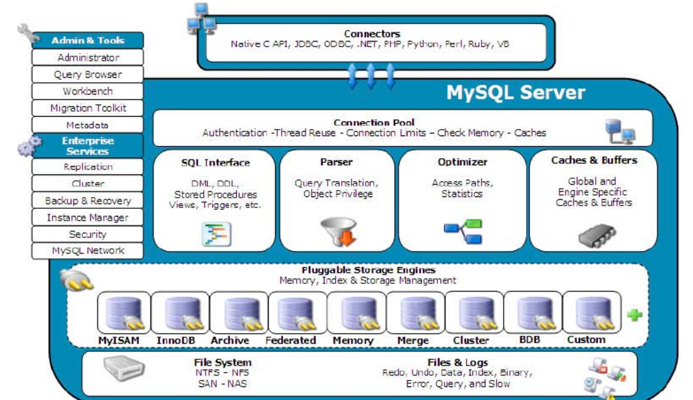
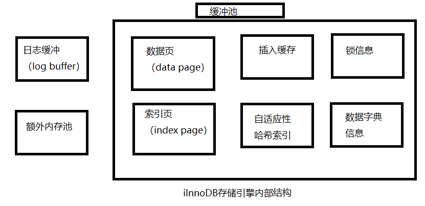
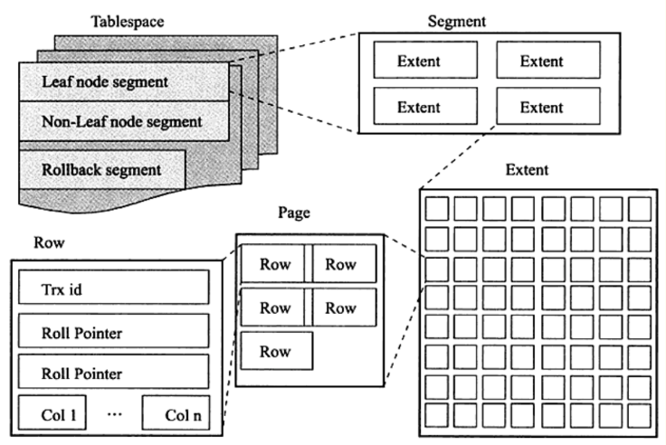
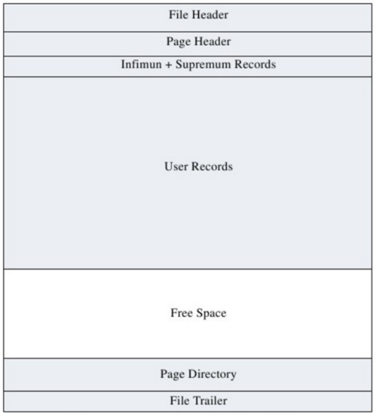

# MySQL

## 第一章·MySQL体系结构和存储引擎

<<<<<<< HEAD
=======

>>>>>> 3f255cac76eff92b5bf9a3185872b6a17375de0c

  											                                   MySQL体系结构

### 1.1MySQL组成部分

由图可知MySQL组成部分

1.连接池组件

2.管理服务和工具组件

3.SQL接口组件

4.查询分析器组件

5.优化器组件

6.缓冲（cache）组件

7.插件式存储引擎

8.物理文件

*MySQL底层共分为四层：连接层（1），服务层（2，3，4，5，6），引擎层（7），存储层（8）*

**功能**：

​	接口层：完成一些客户端的连接服务

​	服务层：大部分核心功能，如：SQL接口，完成缓存的查询，SQL优化和内置函数的执行

​	引擎层：MySQL的存储引擎是插件式的，这是MySQL公司提供的一种访问文件系统的文件访问层的抽象接口

​	存储层：二进制文件

*<u>注意：存储引擎是基于表的，不是基于数据库</u>*	

### 1.2MySQL表存储引擎

​	*根据具体的应用选择合适的存储引擎*

​	1.2.1InnoDB存储引擎

​		InnoDB主要面向在线事务处理（OLTP）方面的应用，其特点是支持行锁设计，支持外键，非锁定读，即默认情况下读操作不会产生锁。

​		InnoDB通过多版本并发控制（MVCC）来获得高并发性。同时使用一种被称为next-key locking的策略来避免幻读现象的产生。除此之外，InnoDB还提供了插入缓存（insert buffer），二次写（double write），自适应性哈希锁（adaptive hash index），预读（read ahead）等高性能和高可用的功能。

​		对于表中数据的存储，InnoDB存储引擎采用了聚集（clustered）的方式。每张表的存储都按主键的顺序存放，如果没有显式的在表定时指定主键，InnoDB存储引擎会为每一行生成一个6字节的ROWID，并以此作为主键。	

​	1.2.2MyISAM存储引擎

​		MyISAM是MySQL官方提供的存储引擎。其特点是不支持事务，表锁和全文索引。对一些OLAP（Online Analytical Processing，在线分析处理）操作速度快。

​		MyISAM存储引擎表由MYD和MYI组成，MYD用来存放数据文件，MYI用来存放索引文件。	

​	1.2.3Memery存储引擎

​		Memory存储引擎将表中的数据存放在内存中。如果数据库重启或者是发生奔溃，表中的数据都会消失。所以他非常适合作临时表，以及数据仓库的维度表。他默认使用hash索引，而不是b+树索引。

​		此外，memory存储引擎只支持表锁，所以他并发性能比较差，并且不支持text和blob列类型。最重要的是，存储变长字段（varchar）是按照定长字段的方式进行的，会浪费内存。

​		*有一点被忽视的是，MySQL数据库使用memory存储引擎存放临时表数据时，当临时数据量大于memory存储引擎的容量设定时，MySQL回他数据存放到磁盘中，因此会产生临时表，此时对于查询来说性能就会损失*

## 第二章· InnoDB存储引擎

### 2.1InnoDB的体系结构

InnoDB有多个内存块，可以认为这些内存块组成了一个大的内存池，负责如下工作：

- 维护所有进程需要访问的多个内部数据结构

- 缓存磁盘上的数据，方便快速的读取，并且在对磁盘文件的数据进行修改之前在这里缓存

- 重做日志（redo log）缓存

- ... 

​		后台线程的主要作用是负责刷新内存池中的数据，保证缓冲池中的内存缓存的是最近的数据。此外，将已修改的数据文件刷新到磁盘文件，同时保证在数据库发生出异常的情况下InnoDB能恢复到正常的运行状态。

#### 2.1.1后台线程

​		InnoDB存储引擎是在一个被称作master thread的线程上，master thread几乎实现了所有的功能

​		默认情况下，MySQL存储引擎的后台线程一共有7个----四个IO thread，一个master thread，一个锁监控线程，一个错误监控线程。IO thread的数量由配置文件的io_threads参数提供

##### 四个IOthread

- insert buffer thread
- log thread
- read thread 
- write thread

#### 	2.1.2 内存

InnoDB存储引擎组成部分:缓冲池，重做日志缓冲 以及额外的内存池。

​		缓冲池是占最大块内存的部分，用来存放各种数据的缓冲。因为InnoDB的存储引擎的工作方式是将数据库按页（每页16K）读取到缓冲池，然后按最近最少未使用（LRU）的算法来保留缓冲池的数据。如果数据库文件需要修改，总是西安修改在缓冲池中的页（发生修改后，该页即为脏页），然后在按照一定频率将缓冲池的脏页刷新到文件。

​		具体来看，缓冲池缓存的数据页类型有：索引页，数据页，undo页（*数据库未修改前的数据页*），插入缓存，自适应性哈希索引，InnoDB存储的锁信息（lock info），数据字典信息等。

## 2.2master thread

#### 2.2.1 master thread源码分析

​        master thread的线程优先级别最高。其内部由几个循环（loop）组成：主循环（loop），后台循环（background loop），刷新循环（flush loop），暂停循环（suspend loop）。master thread会根据数据库状态在四种循环间切换。

loop主循环大多数由两个操作：每秒的操作和每十秒的操作，伪代码如下

`void master_thread(){`

​	loop:

​	for(int i=0;i<10;i++){

​			do thing once per second

​			sleep 1 second if neccessary

​	}

​	do things once per ten seconds

​	go loop;

`}`

可以看到，loop循环通过thread sleep来实现。在负载很大的情况下可能会有延迟，只能说大概在十秒一次或一秒一次这个频率下。

每秒一次的操作包括：

- 日志缓存刷新到磁盘，即使这个事务还没有提交（总是）

- 合并插入缓冲（可能）

- 至多刷新100个InnoDB的缓冲池中的脏页到磁盘（可能）

- 如果当前没有用户活动，切换到background loop（可能）

  

  即使某个事务未提交，InnoDB还是会每秒将重做日志缓冲中的内容刷新到重做日志文件中。

*所以再大的数据commit都是非常快的*

​		合并插入缓冲并不是每秒都发生。InnoDB存储引擎会判断当前一秒内IO次数是否小于5次，如果小于5次，InnoDB认为当前IO压力很小，可以执行合并插入缓冲操作。

同样，刷新100个脏页也不是每秒都发生

每十秒的操作，包括如下内容：

- 刷新100个脏页到磁盘（可能）
- 合并至多5个插入缓冲（可能）
- 将日志缓冲刷新到磁盘（总是）
- 删除无用的undo页（总是）
- 刷新100个或者10个脏页到磁盘（总是）
- 产生以恶搞检查点（总是）

background loop，若当前没有用户活动（数据库空闲时），或者数据库关闭时就会切换到这个循环，会执行一下操作

- 删除无用的undo页
- 合并插入20个缓冲
- 跳回到主循环
- 不断刷新100个页，知道条件符合（可能，跳转到flush loop中执行）

## 2.3关键特性

​	InnoDB的关键特性包括插入缓冲，两次写（double write），自适应性哈希索引(adaptive hash index)。这些特性为InnoDB存储引擎带来了更好的性能和更高的可靠性。

#### 2.3.1插入缓冲

​		InnoDB缓冲池中由insert buffer信息，insert buffer和数据页一样，也是物理页的一部分。

​		在应用程序中行记录的插入顺序是按照主键递增的顺序进行插入的。因此，插入聚集索引一般是顺序的，不需要磁盘的随机读取。

*聚簇索引指‘ 直达 ’  ，非聚簇索引指根据索引可能找到的也只是以一个地址*

当进行插入操作时，id（主键，自增）列会自动增长。因此，插入操作一般可以很快完成。但是在非聚簇索引下，叶子节点的插入不是顺序的，插入i性能就会变低，b+树的特性决定了非聚簇索引的离散性。

​		InnoDB存储引擎开创性的设计了插入缓冲，对于非聚簇索引的插入或更新操作，不是每一次插入索引页中。

而是先判断插入的非聚簇索引是否在缓冲池中，如果在，则直接插入；如果不在，则先放入一个插入缓冲区中，

好似欺骗数据库这个非聚集的索引已经插入到叶子节点了，然后在以一定的频率执行插入缓冲和非聚集索引叶子节点的合并操作，这是通常就能将多个插入合并到一个操作中（因为在一个索引页中），这就大大提高了聚集索引执行插入和修改操作的性能。

​		插入缓冲的使用需要满足以下两个条件：

- 索引是辅助索引
- 索引不是唯一的

当满足条件时，InnoDB会自动使用插入缓冲，这样就能提高性能了。

<i> 当数据库对大量非聚簇索引列进行插入和更新操作，这些操作都涉及了不唯一的非聚簇索引，如果这个过程中数据库发生了宕机，这时候会有大量的插入缓冲并没有合并到实际的非聚集索引中。如果是这样，回复可能需要很长的时间，极端情况下甚至需要几个小时来执行合并并恢复操作。</i>

#### 2.3.2 二次写

​			

​	  插入缓冲带给InnoDB存储引擎的是性能，那么两次写带给InnoDB存储引擎的是数据的可靠性。当数据库发生宕机时，可能发生数据库正在写一个页面（只写了一部分），我们称为写失效（partial page write）。

​		可以通过日志恢复。但如果这个页已经损坏，在对其进行重做是没有意义的。也就是说，在应用重做日志前，我们需要一个页的副本，当写失效发生时，先通过页的副本还原页，在进行重做，这就是doubleWrite。

<i>doubleWrite组成部分：内存中的 doubleWrite buffer；物理磁盘上共享表空间中连续的128个页，当缓冲池的脏页刷新时，并不直接写磁盘，而是会通过memcpy函数将脏页先拷贝到内存中的doubleWrite buffer中，之后通过doubleWrite buffer再分两次，每次写1MB到共享表空间的物理磁盘上，然后马上调用 fsync函数，同步磁盘，避免缓冲写带来的问题。在这个过程中，因为doubleWrite页是连续的，因此这个过程是顺序写的的，开销并不是很大。在完成doubleWrite页的写入之后，再将doubleWrite buffer中的页写入各个表空间文件中，此时的写入是离散的。</i>

#### 2.3.3自适应哈希索引

​		MySQL中heap存储引擎默认的索引类型为hash索引，而InnoDB实现了另一种方法，自适应哈希索引（adaptive hash index）。

​		InnoDB存储引擎会监控对表上的索引的查找，如果观察到建立哈希索引可以带来速度的提升，则建立哈希索引，所以称为自适应的（adaptive）。自适应哈希索引通过缓冲池的b+树构造而来，因此建立的速度很快。而且不需要将整个表都建立哈希索引。InnoDB会自动根据访问频率和模式来为某些页来建立哈希索引。

​		InnoDB官方文档显示，使用自适应哈希索引读取和写入速度可以提高两倍。对于辅助索引的连接操作，性能可以提高5倍。其设计思想是数据库自动优化。

#### 2.3.4启动，关闭与恢复

​		MySQL实例的启动过程中对InnoDB表存储引擎的处理过程，

​		参数Innodb_fast_shutdown 的参数值可取0，1，2

- 0. InooDB会完成所有的full purge和merge insert buffer操作。
  1. 只会将脏页数据刷新到磁盘
  2. 不会完成full purge和merge insert buffer操作，也不会将缓冲池的数据脏页写回到磁盘，而是将日志写入日志文件。这样就不会有任何的事务丢失，但是数据库下次启动时，会执行恢复操作。

  参数innodb_force_recovery默认值为0，表示当数据库需要恢复时，执行所有的恢复操作。

##   第三章· 表

### 3.1InnoDB逻辑存储结构

​		InnoDB存储引擎所有数据都存放在表空间中。表空间由 段，区，页组成。

#### 3.1.1表空间

​		表空间是InnoDB存储引擎逻辑结构的最高层，所有数据都存放在表空间中。

#### 3.1.2段

​		表空间是由各个段组成的，常见的有数据段，索引段，回滚段等。InnoDB存储引擎表是索引组织的，因此数据即索引，索引即数据。数据段即为b+树的叶节点，索引段即为b+树的非索引节点。

​		InnoDB存储引擎的管理是由引擎本身完成的。

#### 2.1.3区

​		区是由64个连续的页组成的，每个页的大小为16KB，即每个区的大小为1MB.对于大的数据段，InnoDB存储引擎等最多可以每次申请4个区，以此来保证数据的顺序性能。

#### 2.1.4行

​		InnoDB存储引擎是面向行的，也就是说数据是按照行进行存放。每个页存放的行记录也是有硬性定义的，最多可以存放16kb/2~200行的记录。MySQL infobright存储引擎是按照列来存放数据的。

### 3.2InnoDB物理存储结构

​		Inno表由共享表空间，日志文件组（Redo文件组），表结构定义文件组成。

### 3.3InnoDB数据页结构

InnoDB数据页组成部分：

1. File Header(头文件)
2. Page Header(页头)
3. Infimum+Supremum Records.
4. User Records(用户记录，即行记录)
5. Free Space(空闲空间)
6. Page Space(页目录)
7. File Trailer(文件结尾信息)

	

​                          **InnoDB存储引擎数据页结构图**

​		FileHeader，PageHeader，FileTrailer的大小是固定的，用来标示该页的一些信息。如Checksum，数据所在的索引层等。其余的部分为实际的行记录存储空间，因此大小是动态的。	

#### 3.3.1 Infimum和Supermum记录

​		在InnoDB存储引擎中，每个数据页有两个虚拟的记录行，用来限定记录的边界。Infimum记录是比该页中任何主键值都要小的值，Supermum指比任何可能大的值还要大的值。这两个值在页创建时被创建，并且任何情况下都不会被删除。

#### 3.3.2 User Records与FreeSpace

​		User Records即实际存储行记录的内容。InnoDB存储引擎表总是b+树组织索引的。

​		Free Space指的是空闲空间，同样也是个链表数据结构。当一条记录被删除后，该空间会被加入空闲链表中。

#### 3.3.3 Page Directory

​		Page Directory(页目录)中存放了记录的相对位置 （*注意：页相对位置不是偏移量*）InnoDB并不是每个记录拥有一个目录槽，InnoDB存储引擎是一个稀疏目录，即一个槽可能属于多个记录。

​		由于InnoDB存储引擎中Slots是稀疏目录，二叉树查找的结果只是一个粗略的结果，所以InnoDB必须通过recorder header中的next_record来继续查找相关记录。同时，slots很好的解释了 recorder header中的n_owned值的含义，即还有多少记录需要查找。

​		**B+树索引本身并不能找到具体的一条记录，b+树索引能找到只是该记录所在的页。数据库把页载入内存，然后通过Page Directory再进行查找，只不过二叉查找的时间复杂度很低，同时内存中的查找很快，因此我们通常忽略了这部分查找时间。**

### 3.4约束

#### 3.4.1数据完整性

​		关系型数据库本身能保证存储数据的完整性，不需要应用程序的控制，而文件系统一般需要在程序端进行控制。几乎所有的关系型数据库都提供了约束机制，约束提供了一条强大而简易的途径来保证数据库中的数据完整性，数据库完整性有三种形式：

- 实体完整性  保证表中有一个主键。在InnoDB存储引擎表中，我们可以通过primary key或者unique key约束来保证实体的完整性。或者可以编写一个触发器来保证数据的完整性。
- 域完整性 保证数据的值满足特定的条件。在InnoDB存储引擎中，域完整性可以通过以下几种途径来保证：选择合适的数据类型可以确保一个数据值满足特定条件，外键约束，编写触发器，还可以考虑用DEFAULT约束作为强制域完整性的一个方面。
- 参照完整性  保证两个表之间的关系，InnoDB存储引擎支持外键，因此允许用户定义外键以强制参照完整性，也可以通过编写触发器以强势执行。
- primary key
- unique key
- foreign key
- default
- not nul

#### 3.4.2约束和索引的区别

​		当你创建了一个唯一的索引，就创建了一个唯一的约束。但是约束和索引的概念还是有所不同的，约束更是一个逻辑的概念，用来保证数据的完整性，而索引是一个数据结构，有逻辑上的区别，索引在数据库中更是一个物理存储的方式。

#### 3.4.3触发器与约束 **************************

#### 3.4.4外键

一般来说，我们称被引用的表为父表，另一个引用的表为子表。对父表进行操作时，可定义的子表操作为：

- CASCADE：当父表发生delete或update操作时，相对应的子表中的数据也被delete或update。
- SET NULL：当父表发生delete或者update操作时，相应的子表中的数据被更新为null值，当然，子表中相应的列必须允许null值。
- NO ACTION: 当父表发生delete或update操作时，抛出错误，不允许这样的操作。
- RESTRICT: 当父表发生delete或update操作时，抛出错误，不允许这类操作发生。如果定义外键时没有指定on delete或on update，这就是默认的外键设置。

### 3.5 视图

​		视图是一个命名的虚表，它由一个查询来定义，可以当作表使用。与持久表(permanent table)不同的是，视图中的数据没有物理表现形式。

#### 3.5.1视图的作用

​		视图在数据库中发挥着重要的作用。视图的主要用途之一是被用作一个抽象装置，特别是对于一些应用程序，程序本身不需要关心基表(base table) 的结构，只需要按照视图定义来获取数据或者更新数据，因此，视图同时在一定程度上起到一个安全层的作用。

### 3.6分区表

​		分区功能并不是在存储引擎层完成的。因此不止有InnoDB存储引擎支持分区，MYISAM,NDB等都支持。

​		分区这个过程是将一个表或者索引分解为更小，更可管理的部分。就访问数据库的应用而言，从逻辑上讲，只有一个表或者一个索引，但是在物理上这个表或者索引可能由数十个物理分区组成。每个分区都是独立的对象，可以独自处理，也可以作为一个更大的对象的一部分进行处理。

​		MySQL数据库支持的分区为水平分区，并不支持垂直分区。此外，MySQL数据库的分区是局部分区索引，一个区中既存放了数据又存放了索引。

​		分区对于某些sql语句性能可能会带来提高，但是分区要用于高可用性，利于数据库的管理。在OLTP应用中，对于分区的使用应该非常小i性能。

​		5.1版本MySQL数据库支持以下几种类型的分区：

- RANGE分区：行数据基于属于一个给定连续区间的列值放入分区。MySQL5.5开始支持RANGES COLUMNS的分区。

- LIST分区：和RANGE分区类似，只是LIST分区面向的是离散的值。MYSQL 数据库5.5开始支持LISTCOLUMNS的分区。

- HASH分区：用户根据自定义的表达式的返回值来进行分区，返回值不能为负数。

- KEY 分区：根据MySQL数据库提供的哈希函数来进行分区。

  唯一索引可以是允许null值的，并且分区列只要是唯一索引的一个组成部分，不需要整个唯一索引列都是分区列。

#### 3.6.1分区和性能

​		数据库的应用分为两类：一类是OLTP(在线事务处理)，如博客，电子商务，网络游戏等；另一类是OLAP，如数据仓库，数据集市。在一个实际的应用环境中，可能既有OLTP的应用，也有OLAP的应用。如在网络游戏中，玩家操作的游戏数据库应用就是OLTP的，但是游戏厂商可能需要对游戏的日志进行分析，通过分析得到的结果更好的服务与游戏，预测玩家 的行为等，而这是OLAP的应用。

​		对于OLAP的应用，分区的确可以很好的提高查询性能，因为OLAP应用的大多数查询需要频繁地扫描一张很大的表。

 

​                                                                                                                ---***来源于MySQL技术内幕 InnoDB存储引擎***
